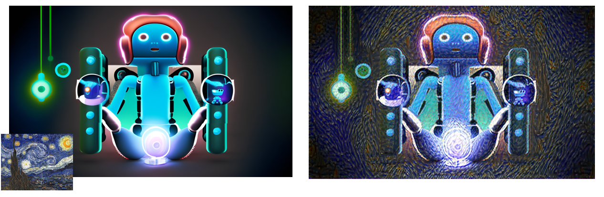
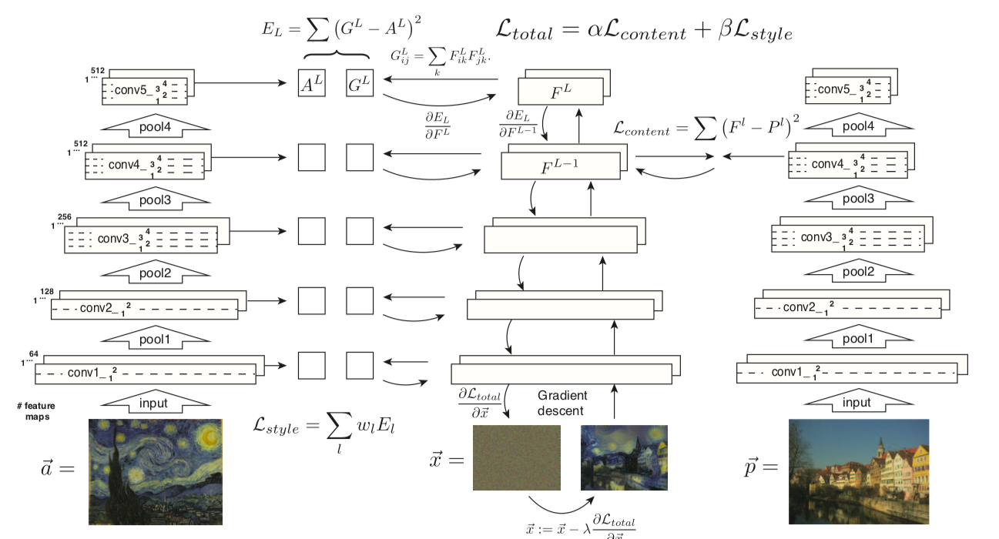

# Neural Style Transfer

Neural Style Transfer es una técnica que utiliza redes neuronales para combinar el estilo artístico de una imagen con el contenido visual de otra. Este repositorio es una implementación del paper [A Neural Algorithm of Artistic Style]( 	
https://doi.org/10.48550/arXiv.1508.06576)

# Uso
    $ git clone https://github.com/yeriel/Neural_Style_Transfer.git
    $ cd Neural_Style_Transfer
    $ pip install -r requirements.txt
    $ python main.py --content='Figures/content.png' --style='Figures/style.png'

# Review paper
## Algoritmo de transferencia de estilo. 

Primero se extraen y almacenan las características de contenido y estilo. La imagen de estilo $\vec{a}$ se pasa a través de la red y se calcula y almacena su representación de estilo $A^l$ en todas las capas incluidas (izquierda). 

La imagen de contenido $\vec{p}$ se pasa a través de la red y se almacena su representación de contenido $P^l$ en una capa (derecha). Luego, se pasa una imagen de ruido blanco aleatorio $\vec{x}$ a través de la red y se calculan sus características de estilo $G^l$ y características de contenido $F^l$. 

En cada capa incluida en la representación de estilo, se calcula la diferencia cuadrática media elemento a elemento entre $G^l$ y $A^l$ para obtener la pérdida de estilo $\mathcal{L}\ style$ (izquierda). También se calcula la diferencia cuadrática media entre $F^l$ y $P^l$ para obtener la pérdida de contenido $\mathcal{L}\ content$ (derecha).

La pérdida total $\mathcal{L}\ total$ es una combinación lineal entre la pérdida de contenido y la de estilo. Su derivada con respecto a los valores de píxel se puede calcular utilizando la retropropagación del error (medio). Este gradiente se utiliza para actualizar iterativamente la imagen $\vec{x}$ hasta que coincida simultáneamente con las características de estilo de la imagen de estilo $\vec{a}$ y las características de contenido de la imagen de contenido $\vec{p}$. Para mas detalle ver la referencia.

# Referencias
- Gatys, L. A., Ecker, A. S., & Bethge, M. (2015). A neural algorithm of artistic style. https://doi.org/10.48550/ARXIV.1508.06576